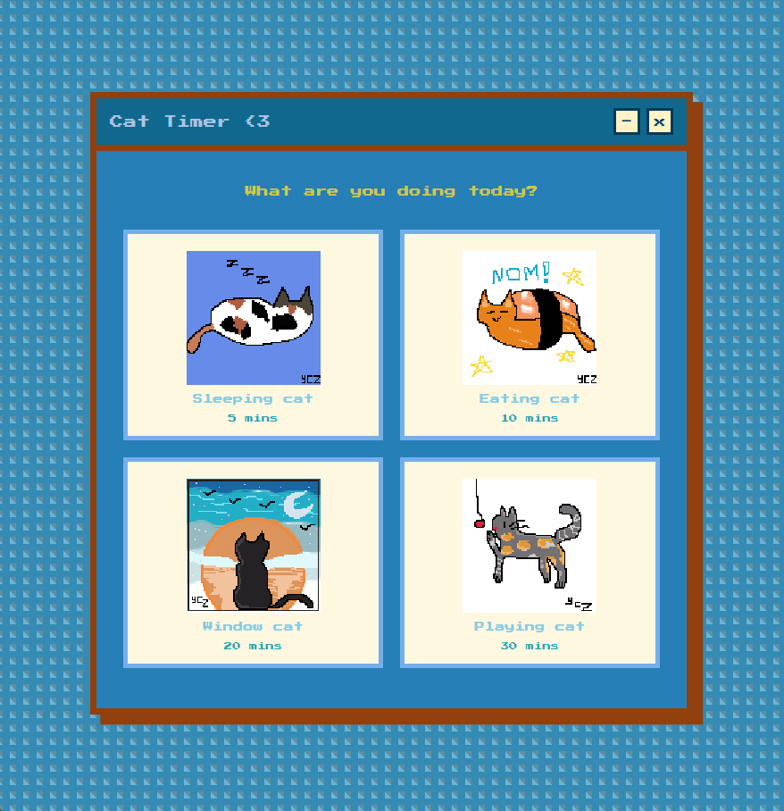
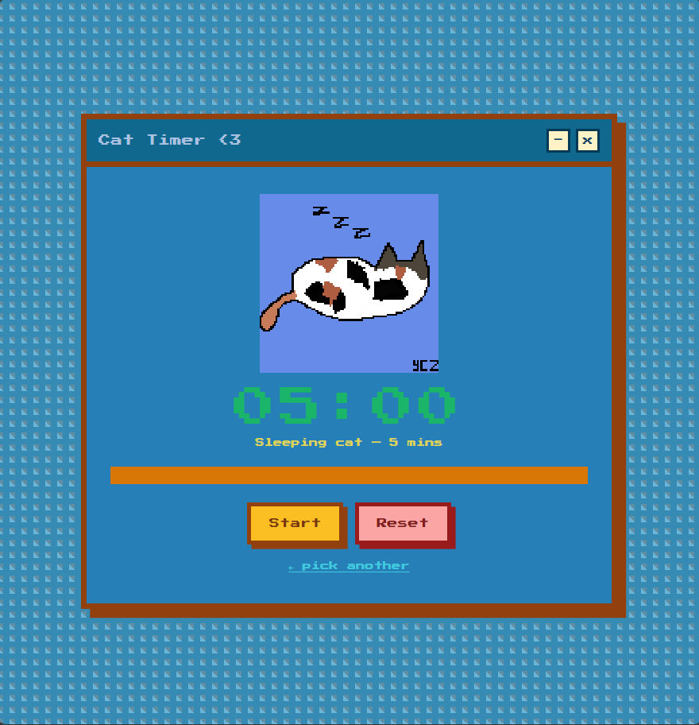

# 🐱 Cat Timer

A cozy pixel-art timer app with animated cat drawings. Pick a cat, set your time, and let your little pixel friend keep you company while you work!

---

## 🎬 Preview

<video src="cat_timer_preview.mp4" width="360" autoplay loop muted playsinline></video>

> *(If the video doesn't play, open it directly: [cat_timer_preview.mp4](cat_timer_preview.mp4))*

---

## 📸 Screenshots

<p>
  
  
</p>

---

## ✨ Features

- 4 animated cats, each with a different timer duration
- Frame-by-frame sprite animation on both the selection screen and timer screen
- Pixel-art retro window style
- Start, Pause, Resume, and Reset controls
- Progress bar that drains as time passes
- "Time's up!" message when the timer ends

---

## 🐾 The Cats

| Cat | Vibe | Duration |
|-----|------|----------|
| 😴 Sleeping cat | Short break / nap | 5 mins |
| 🍽️ Eating cat | Snack / lunch break | 10 mins |
| 🪟 Window cat | Focus session | 20 mins |
| 🎾 Playing cat | Deep work session | 30 mins |

---

## 📁 Folder Setup

Put all files in the **same folder**:

```
cat_timer.html
README.md
cat_timer_preview.mp4           ← preview video
cat_timer_screenshot1.png       ← screenshot 1
cat_timer_screenshot2.png       ← screenshot 2
pixil-frame-1.png               ← sleeping cat, frame 1
pixil-frame-2.png       ← sleeping cat, frame 2
pixil-frame-3.png       ← sleeping cat, frame 3
eating-frame-1.png      ← eating cat, frame 1
eating-frame-2.png      ← eating cat, frame 2
eating-frame-3.png      ← eating cat, frame 3
window-frame-1.png      ← window cat, frame 1
window-frame-2.png      ← window cat, frame 2
window-frame-3.png      ← window cat, frame 3
playing-frame-1.png     ← playing cat, frame 1
playing-frame-2.png     ← playing cat, frame 2
playing-frame-3.png     ← playing cat, frame 3
```

Then just open `cat_timer.html` in any browser — no installation needed!

---

## 🖼️ Drawing Guidelines

These are the specs used when building the app:

- **Format:** PNG with transparent background
- **Size:** 80 × 80 px (or 160 × 160 px for crisp retro look on sharp screens)
- **Style:** Pixel art — keep `image-rendering: pixelated` in mind, so avoid anti-aliasing
- **Frames:** Each cat has 3 frames that loop continuously

---

## ⚙️ Customization

### Change animation speed
Open `cat_timer.html` and find this line near the top of the `<script>` section:

```js
const FRAME_MS = 500;
```

Lower number = faster animation. Higher number = slower. Default is 500ms per frame.

### Change timer durations
Find the `cats` array in the `<script>` section:

```js
const cats = [
  { label: 'Sleeping cat', minutes: 5,  ... },
  { label: 'Eating cat',   minutes: 10, ... },
  { label: 'Window cat',   minutes: 20, ... },
  { label: 'Playing cat',  minutes: 30, ... },
];
```

Change the `minutes` value for any cat you want.

### Add more frames
Each cat's `frames` array can hold as many filenames as you want — the animation will loop through all of them automatically:

```js
frames: [
  'sleeping-frame-1.png',
  'sleeping-frame-2.png',
  'sleeping-frame-3.png',
  'sleeping-frame-4.png',  // ← just add more!
]
```

### Change frame filenames
Update the filenames inside each cat's `frames` array to match whatever you named your drawings.

---

## 🛠️ Built With

- Plain HTML + CSS + JavaScript — no frameworks, no libraries
- [Press Start 2P](https://fonts.google.com/specimen/Press+Start+2P) font from Google Fonts (loaded automatically)
- Pixel art cat animations hand-drawn by myself 🐾

---

## 💛 Made with love and pixel cats
